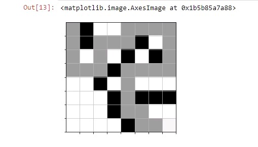
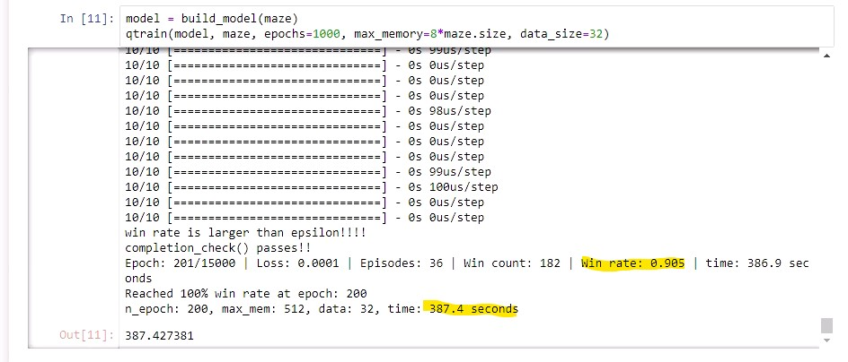

# TreasureHuntGame

TreasureHuntGame is an pathfinding AI project. It is a game where the player needs to find the treasure before the AI pirate agent does. Using a deep Q-learning algorithm, the pirate learns the optimal way to find the treasure from any position on the map.

## Tools Used

This project uses the TensorFlow and Keras libraries in Python to implement deep reinforcement learning.

## Artificial Intelligence Explanation

Machine learning is a subset of AI that uses artificial neural networks. This particular project uses a deep reinforcement learning neural network. Reinforcement learning uses the Markov decision process which involves states, actions, and rewards. For example, the NNs make predictions based on past actions in similar game states which granted specific rewards. After processing the environment, the NNs output the Q-value of all possible actions and decide which action grants the highest reward. After executing the chosen action, the NNs update its model weights to remember and improve. Opposed to Q-learning, deep Q-learning NNs do not store all of the possible actions and states in a Q-table. Instead, it uses an approximation function to generalize Q-values, which results in a machine learning approach suited to more complex environments with more possible actions.

## Screenshots

## CS-370 Specific Questions
